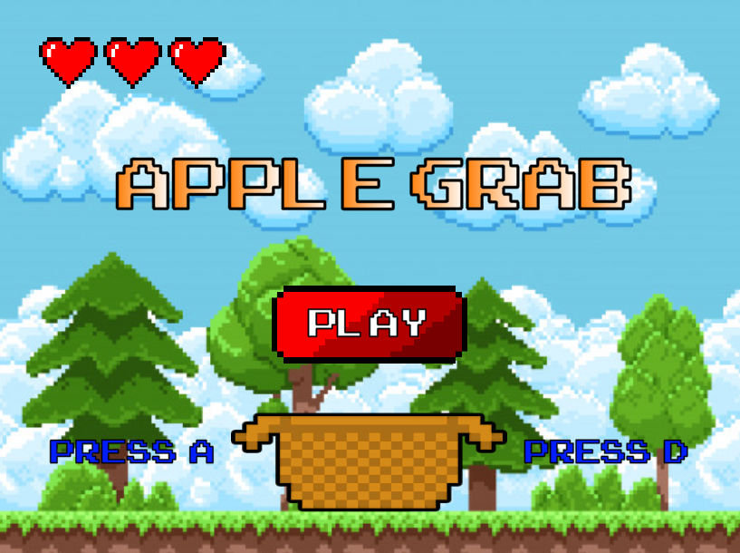

# AppleGrab
Implementación del concepto clásico de Apple Grab en Unity como ejercicio académico.

Desarrollado en Unity 2020.1.0f1.
 

**Créditos**

Crédito a quien corresponda por las imágenes utilizadas. 
Fuente publicada por Jakob Fischer. 
Se utilizaron audios disponibles de forma gratuita para uso no comercial. 
